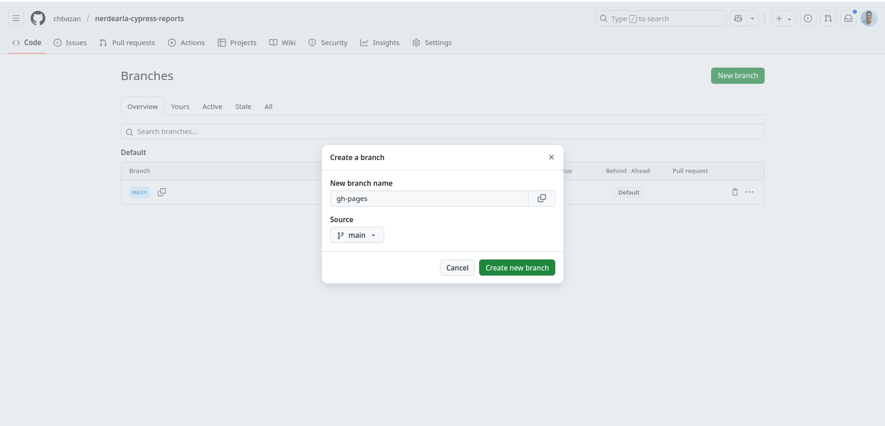
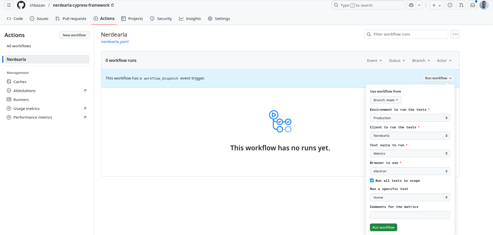

# Framework de Cypress para Nerdearla 🧪

### Índice

1. [Descripción de las pruebas 🚀](#descripción-de-las-pruebas-)
2. [Precondiciones 🔑](#precondiciones)
3. [Configuraciones necesarias ⚙️](#configuraciones-necesarias-️)
   - [Cypress config](#cypress-config)
   - [Repositorio privado](#repositorio-privado)
   - [Repositorio público](#repositorio-público)
   - [GH token](#gh-token)
   - [Slack webhook](#slack-webook)
4. [Ejecución de las pruebas 🐛](#ejecución-de-las-pruebas-)
5. [Variables utilizadas ](#variables-utilizadas-️)
6. [Recomendaciones para armar los casos 🗒](#recomendaciones-para-armar-los-casos-)
7. [Capacitación de Cypress 🤓](#capacitación-de-cypress-)

## Descripción de las Pruebas 🚀

Este repositorio contiene la explicación del uso del framework de Cypress + Python + GH Actions. Las pruebas están diseñadas para validar flujos críticos del aplicativo, verificando su funcionalidad y generando métricas de los tiempos de respuestas experimentados por los usuarios.

## Precondiciones🔑

Para correr las pruebas de forma local es necesario contar con la instalación de Node.JS / NPM y las sieguientes dependencias:

1. [Mochawesome](https://www.npmjs.com/package/mochawesome/v/6.2.1).
2. [Mochawesome Merge](https://www.npmjs.com/package/mochawesome-merge).
3. [Dotenv](https://www.npmjs.com/package/dotenv).

> [Repositorio](https://github.com/nvm-sh/nvm) para instalar node version mager.

Pasos para ejecutar las pruebas y comandos:
1. Clonar este repositorio:
   ```bash
   git clone <url_del_repositorio>
2. Instalar todas las dependencias:

   Este paso es necesario solo la primera vez, o si se agregan nuevas dependencias.
   Es necesario contar con NPM.
   ```bash
   npm ci
3. Abrir la consola de Cypress:
   ```bash
   npx cypress open
4. Ejecutar Cypress desde la terminal en modo headed con un browser específico:
   ```bash
   cypress run --spec cypress/e2e/test.cy.js --browser firefox --headed
5. Ejecutar Cypress mediante script en package json en modo headless:
   ```bash
   Teniendo el script "nerdearla": "cypress run --spec cypress/e2e/nerdearla"
   Ejecutamos npm run nerdearla

>[Lista de comandos](https://docs.cypress.io/guides/guides/command-line) de Cypress.

## Configuraciones necesarias ⚙️

### Cypress config

En el archivo *cypress.config.js* se tiene seteado:

1. La resolución para ejecutar las pruebas:
   ```bash
   viewportWidth: 1600
   viewportHeight: 900
2. Establecer un time out general:
   ```bash
   defaultCommandTimeout: 60000
3. Limpiar cookies y cache entre pruebas:
   ```bash
   testIsolation: false
4. Reporter a usar:
   ```bash
   reporter: 'mochawesome'
5. Opciones del reporter:
   ```bash
    reportDir: 'cypress/reports',
    overwrite: false,
    cleanReporterJson: false,
    html: true,
    json: true,
    reportFilename: 'report',
    embeddedScreenshots: true,
    inlineAssets: true,
6. Ruta de screenshots:
    ```bash
    screenshotsFolder: 'cypress/reports/screenshots',
7. Uso de dotenv:
    ```bash
    require('dotenv').config();
    env: {
      NODE_ENV: { ...process.env },
**A tener en cuenta: Las configuraciones de las rutas seteadas impactan en el workflow de GH Actions.**


> Enlace [acá](https://docs.cypress.io/guides/core-concepts/test-isolation) y [acá](https://docs.cypress.io/guides/tooling/reporters) para más detalle sobre reportes y test isolation.
> 
>[Documentación](https://docs.cypress.io/guides/references/configuration) oficial sobre las configuraciones en Cypress.

### Repositorio privado

Si vas a utilizar un repositorio privado para correr Actions, es necesario que sepas que la idea es hacer publicaciones del reporte de cypress generado (html) mediante GH Pages y esa posibilidad (salvo que pagues) solo está disponible en repositorios públicos. Para el uso de este framework es necesario setear permisos **read and write** dentro de Settings > Actions > General > Workflow permissions.


En el workflow de GH Actions vas a encontrar la variable PRIVATE_REPO que tenés que modificarla con el valor del nombre de tu repositorio, en este ejemplo es: nerdearla-cypress-framework. 

### Repositorio público

El reporte html generado con el nombre index.html se va a publicar en gh pages del repositorio público, para esto es necesario crear un branch con ese nombre y configurar ese repositorio de la siguiente manera:




En el workflow de GH Actions vas a encontrar la variable PUBLIC_REPO que tenés que modificarla con el valor del nombre de tu repositorio, en este ejemplo es: nerdearla-cypress-reports.

### GH Token

Para poder pushear a la rama "metrics" dentro de nuestro repo privado como también poder pushear al público, como también generar ciertas métricas (stability) necesitamos crear un token en github, para esto dentro de nuestro perfil vamos a Settings > Developer settings > Personal access tokens > Fine-grained tokens, vamos a poder seleccionar los repositorios que utilicen el token y darles los permisos necesarios, para este framework necesitamos: Actions: Read-only y Contents: Read and wirte. Luego ese token lo guardamos en un secret dentro del repositorio en Settings > Secrets and variables > Actions. Tené en cuenta que el valor utilizado en el workflow de GH Actions es GH_TOKEN asi que si le pones otro nombre tenés que adaptarlo en el job.


### Slack Webook

Para poder integrar las alertas a slack necesitamos configurar el canal y también setear una URL como secret, para eso accedemos a la siguiente [URL](https://mercap.slack.com/marketplace/A0F7XDUAZ-incoming-webhooks). Tené en cuenta que el valor utilizado en el workflow de GH Actions es NERDEARLA_SLACK_WEBHOOK asi que si le pones otro nombre tenés que adaptarlo en el job.


### Variables utilizadas

Estas variables afectan a todo el test y pueden ser modificadas desde el archivo .env, se deja un archivo .env-example en con las utilizadas.

- LOCATION={url de la aplicación, por ejemplo producción, desa, staging}
- TEST_USER={usuario para hacer login, que se deja en secrets}
- TEST_PASSWORD{password del usuario, que también se setea en secrets}

En el job de gh actions se utilizan:

- ENVIRONMENT=
- CLIENT=
- TEST=
- BROWSER=
- COMMENTS=
- PUBLIC_REPO=
- PRIVATE_REPO=
- LOCATION=
- TEST_USER=
- TEST_PASSWORD=
- VERSION=
- ALERT_MSG=
- FORMATTED_ALERTS=
- TEST_SUMMARY=
- SUITE_METRICS=
- FAILED_TESTS=
- ERROR_MESSAGES=
- PASSED_SUITES=
- STABILITY=
- SCREENSHOT_FOLDER=
- SCREENSHOT_NAME=
- ENCODED_TEST_SUITE=
- GH_TOKEN=
- NERDEARLA_SLACK_WEBHOOK=

## Ejecución de las Pruebas 🐛

Dentro de la pestaña Actions vamos a poder correr el workflow llamado Nerdearla pudiendo elegir el ambiente a correr la prueba, el cliente, el test a aplicar, el browser a utilizar, si queremos correr todos los test suites (tildando Run all tests in scope) o si queremos correr uno en particular, adicionalmente podemos agregar comentarios que van a servir para que las métricas de performance generadas solamente se comparen otra esa descripción utilizada.



Una vez que el workflow finaliza el mismo arroja un mensaje a slack, que puede ser de éxito o de error, mostrando distinta información.


## Métricas de performance a nivel UI


### Recomendaciones para armar los casos 🗒

- Dividir los test suite (describe) por funcionalidad, menú o algún aspecto que englobe las pruebas (los distintos it) a correr. Ejemplo: Se tiene un test suite llamado "Compras" que contiene un flujo de pruebas con distintos it a seguir: Agregar items al carrito, hacer el checkout de la compra, confirmarla, etc.
- En el caso de tener una funcionalidad que se pueda crear, modificar y/o eliminar, crear el it que recorra todo ese proceso dejando para último el borrado (Alta, Modificación y Baja). Esto es para que la prueba pueda volver a correrse sin tener un elemento creado anteriormente.
- Utilizar las validaciones (shoulds) suficientes para validar el elemento (***tener un should por it***), teniendo cuidado de no ser tan detallista. Por ejemplo: Tal vez no es necesario que se valide que se muestren exactamente 8 .card-body en la pantalla del home. Esto es para evitar que el caso falle, cuando en algún momento se agregue otro .card-body.
- Tener cuidado con que selector utilizar, si es dinámico, si no es muy específico, si solo se ubica por texto, etc. Siempre es mejor tomar un selector que pueda ser único para esa pantalla en particular.
- Elegir correctamente la resolución de pantalla para las pruebas, porque si no, puede que algunos elementos se superpongan o no sean visibles para poder seleccionarlos.
- Definir un tiempo de timeout global, para no tener que ir haciendo "waits" particulares en los elementos que pueden demorar más tiempo del normal en aparecer para poder ser seleccionados o validados.
- Utilizar elementos que deberían ser (o no) visibles para hacer validaciones. Por ejemplo, para los casos que se espera que un elemento aparezca después de haber interactuar con otro, o viceversa si se elimina o modifica después de haber realizado cierta acción. Sirve para mensajes de error, de advertencia, de información, de registro exitoso, para un nuevo objeto creado, modificado o eliminado, etc.

#### Capacitación de Cypress 🤓

#### Sentencias básicas de Cypress:
* __cy.visit()__: Visita una URL específica.
* __cy.origin()__: Permite visitar una URL estando dentro de otra.
* __cy.get()__: Selecciona un elemento en la página.
* __cy.click()__: Simula un clic en un elemento.
* __cy.type()__: Simula el ingreso de texto en un campo.
* __cy.contains()__: Busca un elemento que contenga un texto en específico.
* __cy.should()__: Verifica que un elemento cumpla con ciertas condiciones.
> **Nota:** ¿Que es son los "commands" en Cypress?
> 
> Son funciones personalizadas que sirven para encapsular secuencias de comandos repetitivas o acciones específicas.
> Esto te permite reutilizar código y mantener las pruebas más organizadas y legibles.

> **Nota:** ¿Que es son los "it" en Cypress?
> 
> Representantan los casos de pruebas a realizar.

> **Nota:** ¿Que es una "precondición"?
> 
> Es un paso anterior necesario para poder empezar a realizar las pruebas.

#### Formas de poder tomar un selector en Cypress:
1. Mediante un texto en particular:
   ```bash
   cy.contains('Simular Inversión')
2. Mediante una clase:
   ```bash
   cy.get('.col-xl-4')
3. Mediante ID:
   ```bash
   cy.get('#investmentAmount')
4. Un elemento dentro de otro:
   ```bash
   cy.get(':nth-child(5) > #exchangeRate')
5. Un atributo particular de un elemento:
   ```bash
   cy.get('div[class="gy-4 row"]')
6. Un atributo específico de un elemento:
   ```bash
   cy.get('button[class="float-end btn btn-primary"]').eq(0)


> Enlace [acá](https://filiphric.com/cypress-basics-selecting-elements) para entender de forma básica como tomar elementos del DOM. 
>
> Enlace [acá](https://example.cypress.io/commands/traversal) para tener información mas detallada de selectores.
>
> [Documentación](https://docs.cypress.io/api/commands/get) oficial sobre obtener elementos.

#### Validaciones posibles en Cypress:
1. Verifica si un elemento existe en el DOM:
   ```bash
   should('exist')
2. Verifica si un elemento es visible en la pantalla:
   ```bash
   should('be.visible')
3. Verifica si un elemento está habilitado:
   ```bash
   should('be.enabled')
4. Verifica si un elemento contiene el texto especificado:
   ```bash
   should('contain', 'text')   
5. Verifica si un elemento tiene un valor en particular:
   ```bash
   should('have.value', 'value')
6. Verifica si un elemento tiene el atributo especificado con el valor especificado:
   ```bash
   should('have.attr', 'attributeName', 'value')
7. "Negativas", es decir si un elemento NO es, no tiene, no contiene, etc:
   ```bash
   should('not.be.visible')
   should('be.disabled')
   should('not.contain', 'text')
   should('not.have.text', 'text')
8. "Múltiples", utilizando el **.and** se pueden sumar las validaciones a realizar:
   ```bash
   cy.get('button[class="float-end btn btn-primary"]').eq(0)
      .should('exist')
      .and('be.visible')
      .and('have.text', 'Simular')
> Enlace [acá](https://glebbahmutov.com/cypress-examples/commands/assertions.html) para tener información más detallada sobre validaciones y ejemplos de uso.
> [Documentación](https://docs.cypress.io/api/commands/should) oficial acerca de las distindas validaciones posibles.

#### Acciones disponibles en Cypress:
1. Escribe en un elemento:
   ```bash
   type()
2. Hace clic/doble clic/clic derecho en un elemento:
   ```bash
   click()
3. Realiza doble clic/clic derecho en un elemento:
   ```bash
   dblclick()
   rightclick()
4. Marca/Desmarca un elemento de casilla de verificación (checkbox):
   ```bash
   check()
   uncheck()
5. Selecciona una opción de un elemento de lista desplegable:
   ```bash
   select()
6. Borra el contenido de un elemento:
   ```bash
   clear()
7. Desplaza la ventana o un elemento a una posición específica:
   ```bash
   scrollTo()
8. "Acciones dentro de otras" (Enter/Tab/Enviar):
   ```bash
   cy.get('input').type('texto a escribir{enter}')
   cy.get('input').type('texto a escribir{tab}')
   cy.get('form').submit()
9. Seleccionar un archivo y cargarlo:
   ```bash
   cy.get('input[type="file"]').selectFile('ruta/del/archivo')
1. Interacciones del usuario, ejemplo, arrastrar un archivo o pasar el mouse por encima:
   ```bash
   cy.document().selectFile('file.json', { action: 'drag-drop' })
   cy.get('button').trigger('mouseover') // yields 'button'

> Enlace [acá](https://glebbahmutov.com/cypress-examples/commands/actions.html) para tener detalles y ejemplos de uso de las distintas acciones.
> [Documentación](https://docs.cypress.io/guides/core-concepts/interacting-with-elements) oficial acerca de las interaciones con los elementos.

